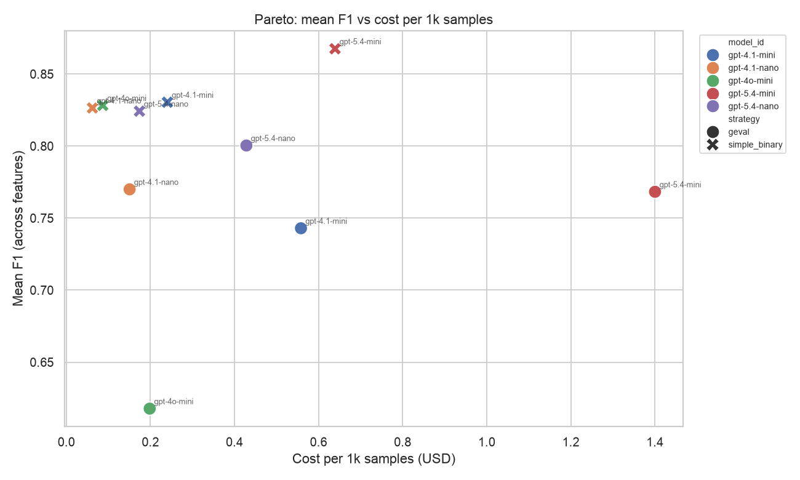
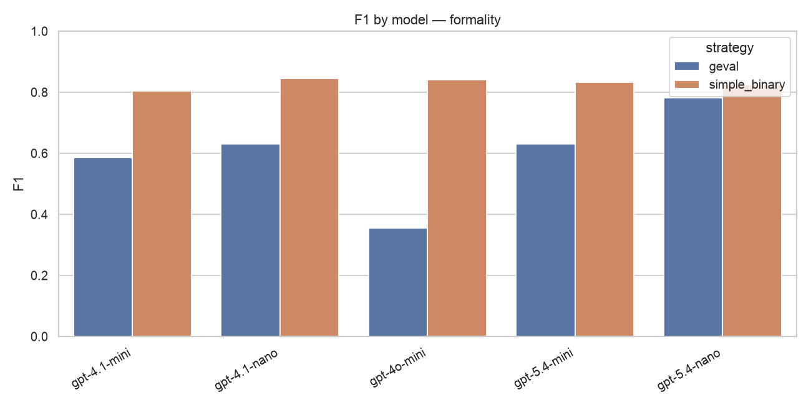
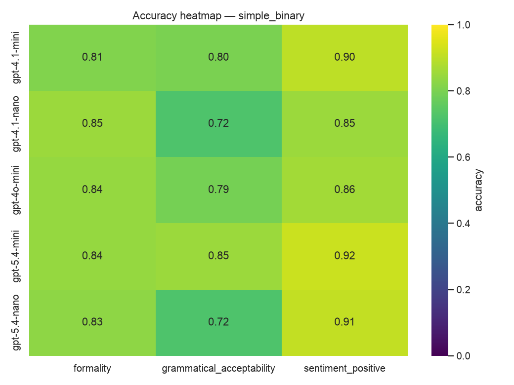
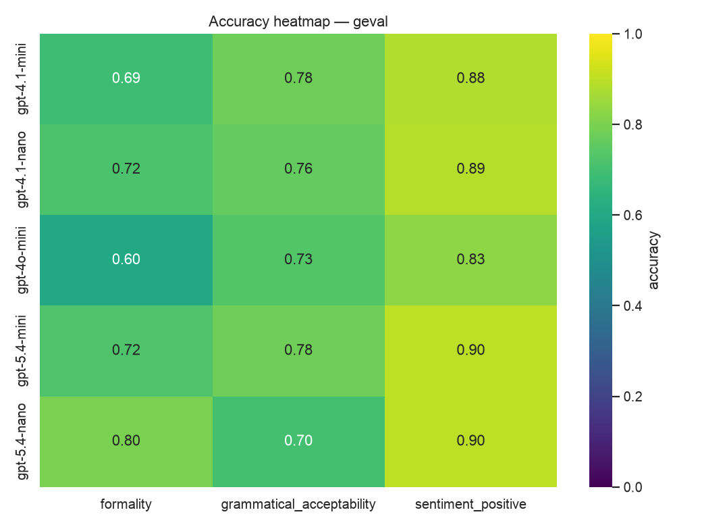
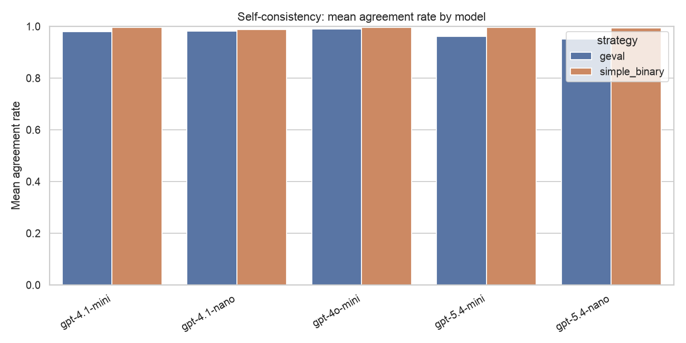

# Evaluation Results: LLM-as-Judge

Reporting section of the project. Comparative analysis of LLMs acting as a *judge* agent for binary text-feature detection, focused on the quality-vs-cost trade-off.

Source data: `results/final_run/report/metrics.csv` and `results/final_run/report/self_consistency.csv`.

---

## 1. Experiment setup

| Parameter | Value |
|-----------|-------|
| Models (5) | `gpt-4.1-nano`, `gpt-4o-mini`, `gpt-4.1-mini`, `gpt-5.4-nano`, `gpt-5.4-mini` |
| Strategies (2) | `simple_binary`, `geval` (DeepEval GEval, threshold 0.8) |
| Features (3) | `sentiment_positive` (SST-2), `formality` (Pavlick), `grammatical_acceptability` (CoLA) |
| Samples | 100 balanced per feature (50/50) |

---

## 2. What we classify (classification parameters)

Each task is a **binary classification** of a sentence/text fragment: does it exhibit a given feature (positive class) or not (negative class). Features are defined declaratively as `FeatureSpec` objects with an explicit positive and negative criterion.

| Feature | Positive class | Negative class | Dataset | Label source |
|---------|----------------|----------------|---------|--------------|
| `sentiment_positive` | positive sentiment (approval, praise, favourable opinion) | negative / neutral / mixed sentiment | SST-2 (`stanfordnlp/sst2`) | label 1 = positive |
| `formality` | formal register (standard grammar, professional/academic/news style) | informal / casual (contractions, slang, chat-like) | Pavlick Formality (`osyvokon/pavlick-formality-scores`) | `avg_score ≥ +0.5` formal, `≤ −0.5` informal, neutral band skipped |
| `grammatical_acceptability` | grammatically acceptable English (native-speaker well-formed) | unacceptable / degraded (syntax, agreement, argument-structure, idiom errors) | CoLA (`nyu-mll/glue`) | label 1 = acceptable |

These three features were chosen because public, gold-labeled corpora exist for them. The pipeline is generic: adding a new feature (e.g. `assertiveness`, `certainty`, `tense`) only requires a new `FeatureSpec`, with no engine changes — relevant for extending toward the grant's feature set later.

### Strategies (how the judge decides)

- **`simple_binary`** — a single prompt returning structured output `{label, confidence, rationale}`. One API call per sample.
- **`geval`** — DeepEval's GEval metric: chain-of-thought scoring on a binary rubric (FAIL `0-4` / PASS `8-10`), thresholded at 0.8. Two API calls per sample (evaluation-steps generation + scoring).

---

## 3. Metrics used

**Classification quality** (computed per `(model, strategy, feature)` against gold labels):

- **Accuracy** — fraction of correct predictions over all evaluated samples.
- **Precision** — of items predicted positive, how many are truly positive (`TP / (TP+FP)`). Penalizes false alarms.
- **Recall** — of truly positive items, how many were found (`TP / (TP+FN)`). Penalizes misses.
- **F1** — harmonic mean of precision and recall for the positive class.
- **Macro-F1** — F1 averaged over both classes; robust to class imbalance and our headline quality metric.
- **Confusion matrix** (TP / TN / FP / FN) — the raw counts behind the above.

**Reliability (self-consistency)** — the same judgment repeated `n` times:

- **Agreement rate** — share of repeats matching the majority label (1.0 = perfectly stable).
- **Binary entropy** — instability of the repeated answers (0 = deterministic).
- **Majority-vote accuracy / F1** — quality after aggregating the `n` repeats by majority vote.

**Cost & efficiency**:

- **Total cost (USD)** — from token usage × per-model pricing.
- **Cost per 1k samples** and **cost per correct label** — normalized cost views.
- **Input / output token counts** — drivers of cost and latency (analyzed in §6).

**Operational**:

- **Latency** (mean / p50 / p95, ms), **API calls**, **retries**, **failure rate**.

---

## 4. Key findings (TL;DR)

1. **`simple_binary` beats `geval` on every axis at once**: higher accuracy (0.833 vs 0.778), lower cost (~2.3× cheaper), lower latency (~2.6× faster). The more elaborate baseline (GEval) is worse here.
2. **Best quality/cost ratio**: `gpt-4.1-nano` + `simple_binary` — accuracy 0.807 at the lowest cost per correct label ($0.000077).
3. **Highest quality**: `gpt-5.4-mini` + `simple_binary` — accuracy 0.870, but ~10× more expensive than nano.
4. **GEval has a systematic recall problem on `formality`** (0.22–0.48): it over-predicts "informal".
5. **Self-consistency adds little at temp=0**: agreement 0.97–0.99, so majority voting barely changes results — `n=3` does not justify the ~4× cost.

---

## 5. Strategy comparison: `simple_binary` vs `geval`

| Strategy | Accuracy | Macro-F1 | Total cost | Mean latency |
|----------|----------|----------|------------|--------------|
| `simple_binary` | **0.833** | **0.831** | **$0.361** | **1131 ms** |
| `geval` | 0.778 | 0.769 | $0.821 | 2992 ms |

This is the project's headline result: a simple single prompt with structured output **dominates** GEval on this task. GEval makes two calls per sample and emits chain-of-thought, raising cost and latency; with the 0.8 threshold and a binary rubric it is also too conservative, leaning toward the negative class.

Practical takeaway for the grant pipeline: a simple prompt suffices for hard binary feature verification; GEval remains a useful research baseline but is not optimal here.

---

## 6. Token usage analysis

| Strategy | Input tokens / call | Output tokens / call | Input / sample | Output / sample |
|----------|--------------------|---------------------|----------------|-----------------|
| `simple_binary` | 408.6 | 60.0 | 408.6 | 60.0 |
| `geval` | 335.8 | 98.9 | 671.7 | 197.7 |

Per **API call**, GEval actually has a smaller input prompt, but ~65% more output tokens (chain-of-thought reasoning). Per **sample**, the gap widens because GEval issues two calls: it consumes ~1.6× more input and ~3.3× more output tokens than `simple_binary`. Output tokens are priced 4–6× higher than input tokens, so this output-token blow-up is the main reason GEval costs ~2.3× more overall.

Total tokens across the run: `geval` 1,007,545 in / 296,606 out vs `simple_binary` 612,920 in / 89,968 out.

Output tokens per call by model (proxy for verbosity):

| Model | `simple_binary` out/call | `geval` out/call |
|-------|--------------------------|------------------|
| gpt-4o-mini | 50.7 | 84.6 |
| gpt-4.1-mini | 56.5 | 92.0 |
| gpt-5.4-mini | 65.5 | 98.4 |
| gpt-4.1-nano | 61.5 | 102.7 |
| gpt-5.4-nano | 65.7 | 116.6 |

The nano models are the most verbose under GEval (up to ~117 output tokens/call), which partially erodes their cost advantage in the GEval setting — another reason to prefer `simple_binary` for cheap models.

---

## 7. Model ranking (averaged over both strategies and features)

| Model | Accuracy | Macro-F1 | Total cost | Mean latency |
|-------|----------|----------|------------|--------------|
| `gpt-5.4-mini` | **0.835** | **0.832** | $0.612 | 2257 ms |
| `gpt-4.1-mini` | 0.810 | 0.806 | $0.240 | 2095 ms |
| `gpt-5.4-nano` | 0.810 | 0.809 | $0.181 | 2091 ms |
| `gpt-4.1-nano` | 0.798 | 0.791 | $0.064 | 1551 ms |
| `gpt-4o-mini` | 0.775 | 0.762 | $0.086 | 2314 ms |

The gap between the best (`gpt-5.4-mini`, 0.835) and the cheapest sensible option (`gpt-4.1-nano`, 0.798) is only **~3.7 pp**, at a ~10× cost difference. `gpt-4o-mini` is the weakest, mostly due to GEval collapsing on `formality`.

---

## 8. Quality vs cost trade-off (Pareto)

On the Pareto front (highest F1 at a given cost):

- **`gpt-4.1-nano` + `simple_binary`** — the "value" point: near-best F1 at the lowest cost.
- **`gpt-5.4-mini` + `simple_binary`** — the "max quality" point: highest F1, but clearly more expensive.

Every `geval` variant (circles) sits **below and to the right** of its matching `simple_binary` variant (crosses) — i.e. simultaneously worse and pricier. Extreme case: `gpt-5.4-mini` + `geval` is the most expensive point on the chart with a lower F1 than its own `simple_binary` variant.

### Cost per correct label (USD, mean)

| Model | `simple_binary` | `geval` |
|-------|-----------------|---------|
| `gpt-4.1-nano` | **$0.000077** | $0.000193 |
| `gpt-4o-mini` | $0.000104 | $0.000281 |
| `gpt-5.4-nano` | $0.000215 | $0.000542 |
| `gpt-4.1-mini` | $0.000288 | $0.000719 |
| `gpt-5.4-mini` | $0.000736 | $0.001766 |

`gpt-4.1-nano` + `simple_binary` is ~9.5× cheaper per correct label than `gpt-5.4-mini` + `simple_binary`, giving up only a few accuracy points.

---

## 9. Per-feature analysis

| Feature | Strategy | Accuracy | Macro-F1 |
|---------|----------|----------|----------|
| `sentiment_positive` | simple_binary | 0.888 | 0.887 |
| `sentiment_positive` | geval | 0.880 | 0.878 |
| `formality` | simple_binary | 0.834 | 0.834 |
| `formality` | geval | 0.705 | 0.681 |
| `grammatical_acceptability` | simple_binary | 0.776 | 0.772 |
| `grammatical_acceptability` | geval | 0.750 | 0.747 |

Best variant per feature (by F1):

- `sentiment_positive` → `gpt-5.4-mini` + simple_binary, F1 0.915
- `grammatical_acceptability` → `gpt-5.4-mini` + simple_binary, F1 0.854
- `formality` → `gpt-4.1-nano` + simple_binary, F1 0.845

### Sentiment — the easiest task

All models reach 0.88–0.92. The feature is well-defined and heavily represented in model pretraining; differences across models and strategies are small.

### Formality — where GEval collapses

For every model, `simple_binary` (orange) beats `geval` (blue), sometimes dramatically. The cause is **recall on the "formal" class**:

| Model | Strategy | Precision | Recall | F1 |
|-------|----------|-----------|--------|----|
| gpt-4o-mini | geval | 0.917 | **0.22** | 0.355 |
| gpt-4.1-mini | geval | 0.880 | **0.44** | 0.587 |
| gpt-5.4-mini | geval | 0.923 | **0.48** | 0.632 |
| gpt-4.1-nano | simple_binary | 0.872 | 0.82 | 0.845 |

GEval has high precision but very low recall — it systematically assigns "informal" and misses formal texts. This is an effect of the binary rubric + 0.8 threshold: the model must "strongly" justify formality, so it defaults to the negative class when uncertain. In the extreme, `gpt-4o-mini` detects only 22% of formal texts.

### Grammatical acceptability — the hardest task

Lowest scores (0.70–0.85). CoLA contains subtle violations (argument structure, selectional restrictions, idiomaticity) that LLMs miss when judging surface plausibility. The nano models tend to over-predict "acceptable" (high recall, low precision), e.g. `gpt-4.1-nano` simple_binary: recall 0.96, precision 0.65.

### Accuracy heatmaps

---

## 10. Self-consistency

| Strategy | Mean agreement | Mean entropy |
|----------|----------------|--------------|
| `simple_binary` | 0.994 | 0.017 |
| `geval` | 0.973 | 0.075 |

| Model | Agreement | Entropy | MV F1 |
|-------|-----------|---------|-------|
| gpt-4o-mini | 0.993 | 0.019 | 0.705 |
| gpt-4.1-mini | 0.989 | 0.032 | 0.791 |
| gpt-4.1-nano | 0.985 | 0.041 | 0.815 |
| gpt-5.4-mini | 0.979 | 0.059 | 0.828 |
| gpt-5.4-nano | 0.972 | 0.079 | 0.859 |

Interpretation:

- At `temperature=0` the models are near-deterministic — agreement 0.97–0.99, entropy near 0.
- `simple_binary` is more stable than `geval` (less room for CoT variance).
- Majority voting barely improves accuracy over a single call.

**Conclusion**: in this setting (temp=0, binary features) self-consistency `n=3` is not cost-effective — it multiplies cost ~4× for negligible gain. It would matter only at higher temperature or for more ambiguous features.

---

## 11. Recommendations

| Scenario | Recommendation |
|----------|----------------|
| Default choice (quality/cost) | **`gpt-4.1-nano` + `simple_binary`** |
| Maximum accuracy | **`gpt-5.4-mini` + `simple_binary`** |
| Prompting strategy | **`simple_binary`** — cheaper, faster, more accurate than GEval |
| Self-consistency | Disable at temp=0; enable only at temp>0 or for ambiguous features |

For the steganography pipeline (grant): as a *judge* agent for hard binary feature verification, a cheap nano model with a simple structured prompt is recommended; escalate to `gpt-5.4-mini` only for features where accuracy is critical.
